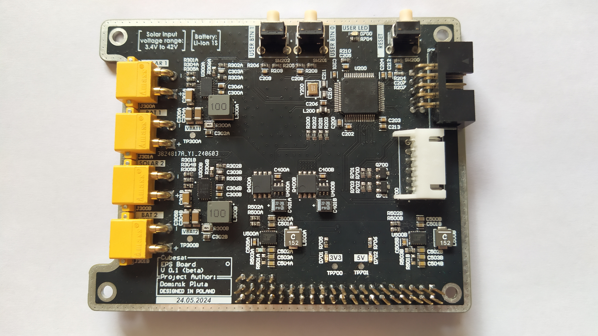

# EPS - Electric Power System

## Used tools:


# Project Overview
This project is part of a CubeSat prototype built as a group project at Wrocław University of Science and Technology. [GitLab Repository](https://gitlab.com/wust-satellite)

The primary functions of this board are:

1. **Battery Management**:
    - Charging a 1S Li-ion battery pack using Maximum Power Point Tracking (MPPT).
    - Monitoring the battery voltage.

2. **Power Conversion**:
    - Generating stable 5V and 3.3V power rails to supply various components of the system.

3. **Communication**:
    - Establishing UART communication with a radio board for data transmission and control.

4. **Deployment of Solar Panels and Radio Antenna**:
    - Providing two power outputs capable of driving high current to external resistors, which can burn wires to deploy the solar panels and antenna.

5. **Remove Before Flight (RBF) Circuit**:
    - Ensuring that the satellite starts operation only after ejection from the launch vehicle.

> **Note**  
> Certain features, such as current monitoring and switches on all power lines, were omitted due to time constraints.

# Schematic - top sheet


# PCB


# Project structure
```
.
├── images
│   ├── logos
│   ├── photos
│   ├── renders
│   └── schematics
├── pcb
│   ├── ***Altium schematic and PCB Documents***
│   ├── ***Altium CAMtastic Documents***
│   ├── ***other Altium files***
│   ├── Lib
│   │   └── ***My parts libraries***
│   └── Project Outputs for EPS_board
│       ├── EPS_full_schematic.pdf
│       ├── ***Gerber and NC drill files***
│       └── EPS_gerber_files.zip
├── code
│   └── ***STM32CubeIDE project***
└── README.md
```