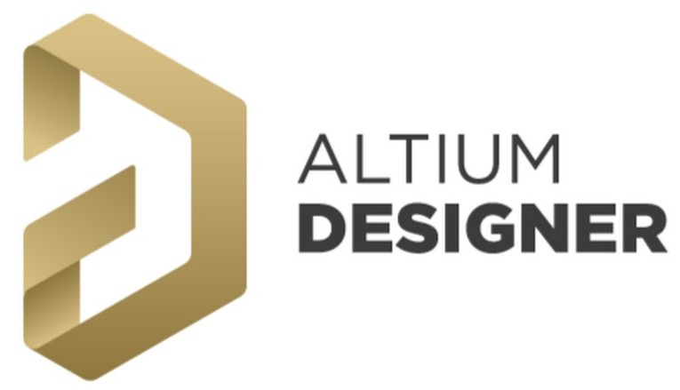
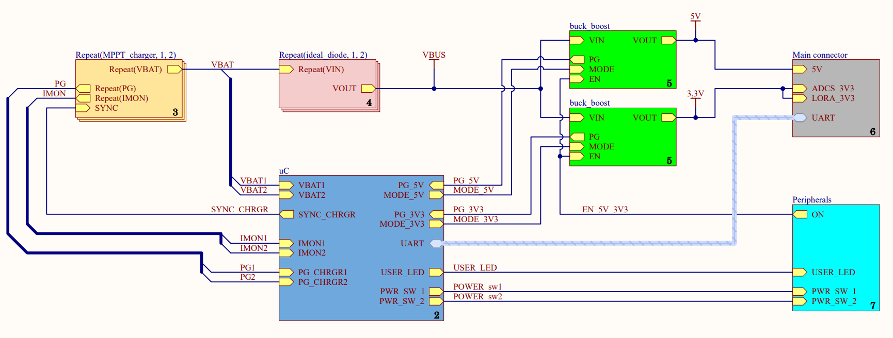
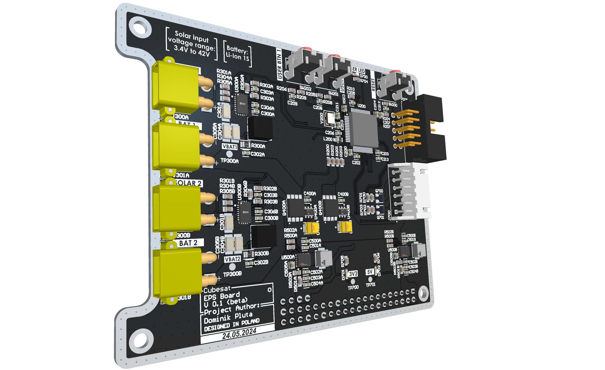
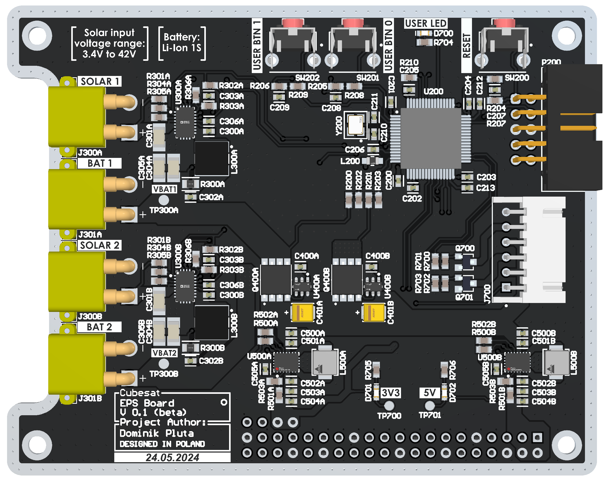
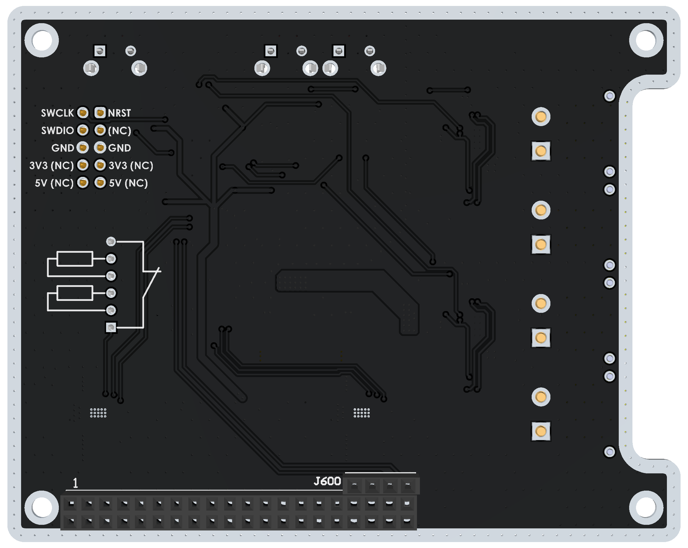

# EPS - Electric Power System

## Used tools


# Schematic - top sheet



# PCB




# Project structure
```
.
├── images
│   ├── logos
│   ├── photos
│   ├── renders
│   └── schematics
├── pcb
│   ├── ***Altium schematic and PCB Documents***
│   ├── ***Altium CAMtastic Documents***
│   ├── ***other Altium files***
│   ├── Lib
│   │   └── ***My parts libraries***
│   └── Project Outputs for EPS_board
│       ├── EPS_full_schematic.pdf
│       ├── ***Gerber and NC drill files***
│       └── EPS_gerber_files.zip
└── README.md
```